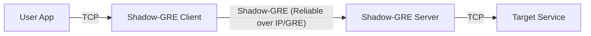

# Shadow-GRE Design Document

This project implements a high-performance, reliable TCP tunnel based on the GRE (Generic Routing Encapsulation) protocol. It utilizes GRE as a transport carrier, encapsulating a custom reliable transport layer within it to achieve transparent forwarding and multiplexing of TCP connections.

## 1. System Architecture Overview

Shadow-GRE adopts a classic Client-Server architecture:

*   **Client**: Deployed on the user side. It listens on local TCP ports, accepts user requests, encapsulates them into Shadow-GRE protocol packets, and sends them to the server via the GRE tunnel.
*   **Server**: Deployed on the network exit side. It receives GRE packets, decapsulates them to restore TCP streams, and connects to the target backend services.



The core design consists of three key components: **GRE Masquerading**, **TCP Encapsulation & Multiplexing**, and the **Reliable Transport Layer**.

---

## 2. GRE Masquerading

To penetrate firewalls or leverage special handling of the GRE protocol in certain network environments, this project uses Raw Sockets to directly construct IP-layer GRE packets.

### 2.1 Raw Socket Implementation
The project uses Go's `syscall` to create raw sockets (`IPPROTO_GRE` / `ip4:gre`). This allows us to read and write the IP payload directly from user space, giving us full control over the GRE header.

*   **File**: `pkg/transport/raw.go`
*   **Socket Type**: `net.ListenIP("ip4:gre", ...)`

### 2.2 GRE Header Construction
Packets strictly follow the standard GRE header format (RFC 2784, RFC 2890), appearing as standard GRE traffic.

```text
 0 1 2 3 4 5 6 7 8 9 0 1 2 3 4 5 6 7 8 9 0 1 2 3 4 5 6 7 8 9 0 1
+-+-+-+-+-+-+-+-+-+-+-+-+-+-+-+-+-+-+-+-+-+-+-+-+-+-+-+-+-+-+-+-+
|C|R|K|S|s|Recur|  Flags  | Ver |         Protocol Type         |
+-+-+-+-+-+-+-+-+-+-+-+-+-+-+-+-+-+-+-+-+-+-+-+-+-+-+-+-+-+-+-+-+
|                              Key                              |
+-+-+-+-+-+-+-+-+-+-+-+-+-+-+-+-+-+-+-+-+-+-+-+-+-+-+-+-+-+-+-+-+
|                         Payload ...                           |
+-+-+-+-+-+-+-+-+-+-+-+-+-+-+-+-+-+-+-+-+-+-+-+-+-+-+-+-+-+-+-+-+
```

*   **Flags (0x2000)**: The `Key Present` bit is set.
*   **Protocol Type (0x6558)**: Uses Transparent Ethernet Bridging (or other custom identifiers) to identify the internal payload type.
*   **Key**: A 32-bit key used for simple authentication and session differentiation.

This design makes the traffic appear as ordinary GRE tunnel traffic to intermediate network devices (routers, firewalls), rather than obvious custom encrypted traffic.

---

## 3. TCP Encapsulation & Multiplexing

Since GRE itself is a connectionless, unreliable protocol, we need to manage TCP connections within the GRE payload using a custom protocol.

### 3.1 Stream Abstraction
The system abstracts each TCP connection as a **Stream**.
*   **Client**: When a new TCP connection is accepted, a unique `StreamID` is allocated.
*   **Server**: Upon receiving a `StreamID`, it establishes a mapping in memory and initiates a TCP connection to the backend.

### 3.2 Asynchronous Processing Model
*   **Server/Client**: Both use a fully asynchronous Goroutine model.
    *   `ReadLoop`: Reads GRE packets from the Raw Socket.
    *   `SendLoop`: Responsible for writing encapsulated GRE packets to the Raw Socket.
    *   `PacketLoop`: Distributes decapsulated data to the corresponding Stream.
*   **Zero-Copy Optimization**: To maximize throughput, buffers are reused wherever possible to minimize memory allocation and copying.

---

## 4. Reliable Transport Design

This is the core of the project. Since GRE (built on top of IP) is unreliable and packet loss or reordering may occur, a reliable transport mechanism similar to TCP must be implemented within GRE to support TCP traffic.

Code Path: `pkg/tunnel/reliable.go`

### 4.1 Custom Reliable Protocol Header
Following the GRE payload is the custom reliable transport header:

```text
 0 1 2 3 4 5 6 7
+---------------+
|   StreamID    | (4 Bytes)
+---------------+
|     Flags     | (1 Byte) - Data/Ack/Syn/Fin/Sack
+---------------+
|      Seq      | (4 Bytes) - Sequence Number
+---------------+
|      Ack      | (4 Bytes) - [Optional] Acknowledgment Number (if FlagAck set)
+---------------+
| SackCount (1) | [Optional] Number of SACK blocks (if FlagSack set)
+---------------+
| SackBlock 1 L | (4 Bytes) [Optional] SACK Block 1 Left Edge
+---------------+
| SackBlock 1 R | (4 Bytes) [Optional] SACK Block 1 Right Edge
+---------------+
...
```

### 4.2 Core Mechanisms

#### A. Sequence Number (Seq) & Acknowledgment Number (Ack)
*   Every sent packet has an incrementing `Seq`.
*   The receiver replies with an `Ack`, indicating the "next expected Seq". This is a **Cumulative ACK**.

#### B. Selective Acknowledgment (SACK)
To efficiently handle retransmissions during packet loss, a SACK mechanism is implemented.
*   **Scenario**: Sender sends 1, 2, 3, 4, 5. Receiver gets 1, 3, 4, 5 (2 is lost).
*   **Standard ACK**: Can only reply with ACK=2 (indicating only 1 was received). The sender doesn't know if 3, 4, 5 arrived and might retransmit everything.
*   **SACK Optimization**: Receiver replies with ACK=2, appended with SACK Block `[3, 5]`.
*   **Fast Retransmit Trigger**: In the code, SACK is also a key signal to trigger **Fast Retransmit**.

#### C. Retransmission Strategy
1.  **RTO (Retransmission Timeout)**:
    *   Calculates RTT (Round Trip Time) and RTO based on RFC 6298 standards.
    *   If no ACK is received within the RTO, a timeout retransmission is triggered.
    *   **Backoff**: Consecutive timeouts cause the RTO to double.

2.  **Fast Retransmit**:
    *   **Trigger Condition**: Receiving 3 Duplicate ACKs or an ACK with SACK Blocks.
    *   **Behavior**: Immediately retransmits the missing packets (Gap) without waiting for the RTO timeout. This significantly reduces latency during packet loss.

#### D. Congestion Control (BBR)
The project implements a lightweight congestion control algorithm inspired by **BBR (Bottleneck Bandwidth and Round-trip propagation time)**.

*   **Core Idea**: Does not rely on packet loss to detect congestion; instead, it uses measurements of **Bandwidth (Bw)** and **Latency (RTT)**.
*   **Measurement Model**:
    *   `maxBw`: Tracks the maximum bandwidth sample over a recent window.
    *   `minRtt`: Tracks the minimum round-trip time.
*   **Transmission Control**:
    *   Calculates BDP (Bandwidth-Delay Product) = `maxBw * minRtt`.
    *   **CWND (Congestion Window)**: Dynamically adjusts the target sending window to `BDP * Gain`.
    *   `canSend` Check: Transmission is allowed only if the number of bytes in flight is less than the CWND.
    *   **Pacing**: A simple Pacing mechanism (e.g., 1ms intervals) is implemented in the underlying `SendLoop` to prevent burst traffic from overflowing buffers.

### 4.3 Write & Receive Flow

*   **Send**:
    1.  Application layer writes data.
    2.  `reliable.Send`: Checks CWND (BBR control).
    3.  Encapsulates Header (Seq, Flags).
    4.  Stores in `unacked` queue (for retransmission).
    5.  Sends via Raw Transport.

*   **Receive**:
    1.  Parses Header.
    2.  **Ack Processing**: Updates `RTT` estimates, removes acknowledged packets from the `unacked` queue, and updates the BBR model (`onAck`). If SACK or Duplicate ACKs are present, triggers fast retransmission.
    3.  **Data Processing**:
        *   If Seq == Expected: In-order arrival, delivered immediately to the app layer.
        *   If Seq > Expected: Out-of-order arrival, buffered in `outOfOrder` cache, and an ACK with SACK is immediately sent to request retransmission of the gap.
    4.  **Ack Reply**: Uses Delayed ACK strategy or sends an immediate ACK every N packets to reduce ACK traffic overhead.

---

## 5. Summary

Shadow-GRE achieves excellent network compatibility by masquerading as a standard GRE tunnel at the IP layer. Internally, it re-implements a complete reliable transport protocol based on BBR congestion control and SACK mechanisms. This allows it to transport data as reliably as TCP while possessing the efficient penetration capabilities and congestion control flexibility of UDP (underlying Raw Socket).
